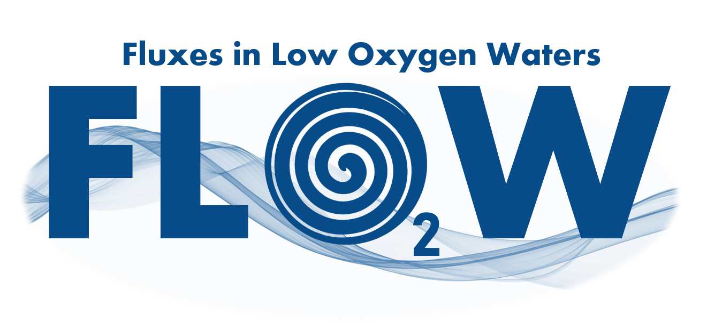
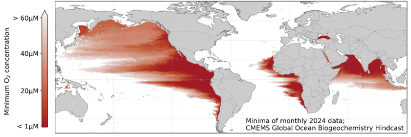
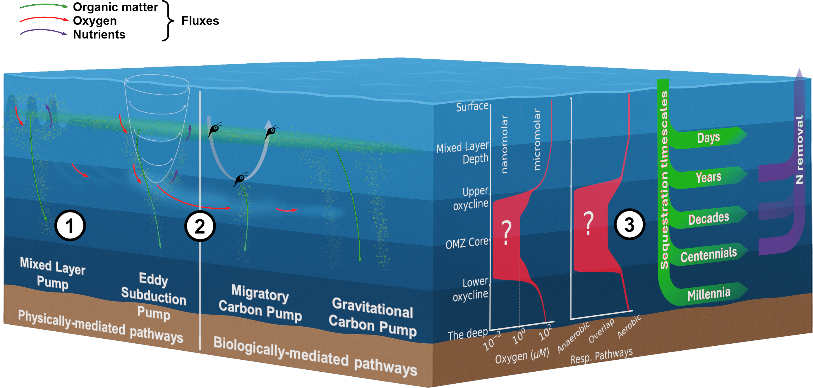

The **FLOW Lab** (Fluxes in Low Oxygen Waters) is a research group at the Department of Marine Sciences, University of Gothenburg (Sweden).

Oxygen minimum zones are vast layers in the ocean with little to no oxygen and vital implications for marine habitats, carbon and nitrogen cycling, and greenhouse gas production. Over the last 50 years, global oceans have been warming and deoxygenating, yet leading climate models are unable to reproduce observed changes in oxygen minimum zones and forecasts vary drastically under all future climate scenarios. The main obstacle is that models cannot resolve features smaller than their computational grid cells and use simplified biogeochemistry and biology. 

**We want to understand the role of different ocean processes, from large to small scales, in tipping the balance back and forth between oxygen supply and oxygen consumption across the world's oceans.**

**Keywords:** `ventilation`, `remineralisation`, `carbon export`, `eddies`, `submesoscale processes`, `autonomous platforms`, `Arabian Sea`, `Baltic Sea`, `oxygen minimum zones`.

**Contact details:** [bastien.queste@marine.gu.se](https://www.gu.se/om-universitetet/hitta-person/bastienqueste)

 
Oxygen minimum zones (*above*, in red) form subsurface layers beneath vast ocean regions, where the balance between aerobic and anaerobic respiration regulates carbon storage and drives marine nitrogen loss.

(*above left*) Particulate and dissolved organic matter is exported (*1: green arrows*) by physical and biological export pumps to the OMZ providing fuel for respiration. Physical carbon pumps also cause simultaneous nutrient and O2 fluxes (*left, 1 & 2, red and purple arrows*). These fine-scale O2 fluxes contribute to variability locally, and remotely when advected (*2*), affecting which respiration pathways are expressed (*3: right*) with global climate impacts via carbon sequestration and nitrogen removal. 